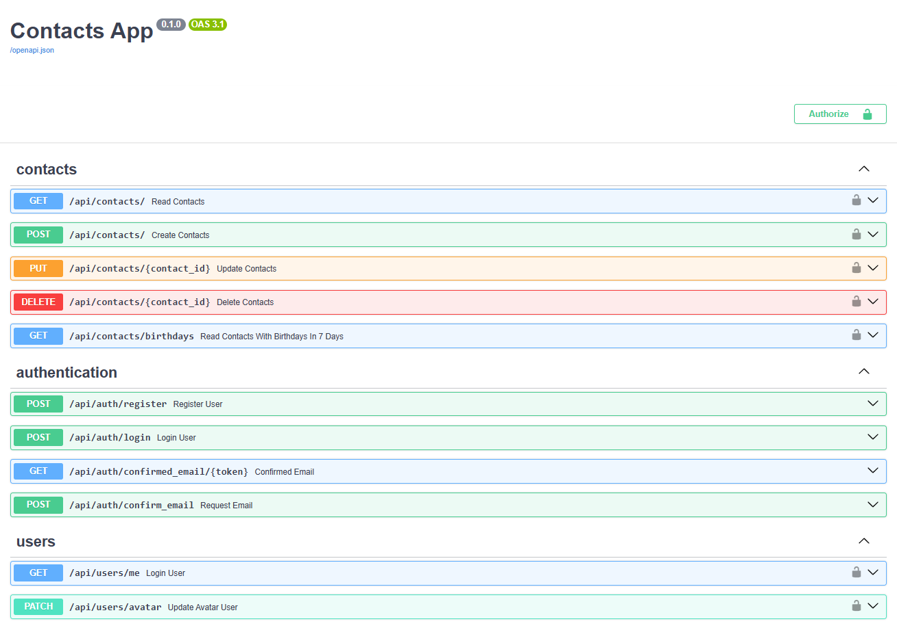

# FastAPI PoC with SQLAlchemy Alembic

## Checkout repo 
To clone the repository, use the following command:
```bash
git clone https://github.com/yourusername/goit-pythonweb-hw-08.git
```

## Run postgres
To run postgres database:
```bash
docker run --name postgres-goit-pythonweb-hw-08 -p 5432:5432 -e POSTGRES_USER=postgres -e POSTGRES_PASSWORD=mysecretpassword -e POSTGRES_DB=hw08 -d postgres
```

## Run application
Apply DDL to DB 
```bash
alembic upgrade head
``` 
To run the server:
```bash
poetry run .\app\main.py
```
By default swagger accessible:
```
http://127.0.0.1:8000/docs#/
```




## How to
### Visual Code and Poetry
In order to enable poerty env in visual code
```bash
poetry config virtualenvs.in-project true

poetry env list
poetry env remove <current environment>
poetry install
```