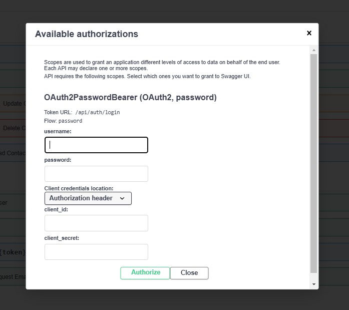

# Python web app with AuthN and AuthZ PoC

## Description
The application is designed for securely storing contacts. Each user can create and manage their own contacts. The interface is provided by Swagger UI, allowing users to send authenticated requests.

### Features and Functionality
* User registration
* Email confirmation
* Avatar management
* User authentication via username and password
* Secure creation, updating, and deletion of contacts
* Contact search based on specific criteria
* Retrieval of contacts with birthdays in the next 7 days

By default Swagger UI accessible:
```
http://localhost:8000/docs#/
```



## Tech stack
* SQLAlchemy
* Alembic
* FastAPI

## Integrations
* Application sents confirmation letters using https://meta.ua/
* Application stores avatars (images) in https://cloudinary.com/
* Uses PostgreSQL for data storage 

## Checkout repo 
To clone the repository, use the following command:
```bash
git clone https://github.com/yourusername/goit-pythonweb-hw-10.git
```

## Run application locally
Register and provide credentials for https://meta.ua/ and https://cloudinary.com/ into .env-example file.
Rename .env-example into .env

Install dependencies
```bash
poetry install
``` 
Active environment
```bash
poetry shell
``` 
Apply DDL to DB 
```bash
alembic upgrade head
``` 
To run the server:
```bash
poetry run .\app\main.py
```

### Run postgres for local setup
Start postgres database:
```bash
docker run --name postgres-goit-pythonweb-hw-10 -p 5432:5432 -e POSTGRES_USER=postgres -e POSTGRES_PASSWORD=mysecretpassword -e POSTGRES_DB=hw10 -d postgres
```

## Run application with docker compose
Register and provide credentials for https://meta.ua/ and https://cloudinary.com/ into .env-example file.
Rename .env-example into .env

```bash
 docker compose -f .\docker-compose.yaml up
```
Scripts 

## How to
### Visual Code and Poetry
In order to enable poerty env in visual code
```bash
poetry config virtualenvs.in-project true

poetry env list
poetry env remove <current environment>
poetry install
```